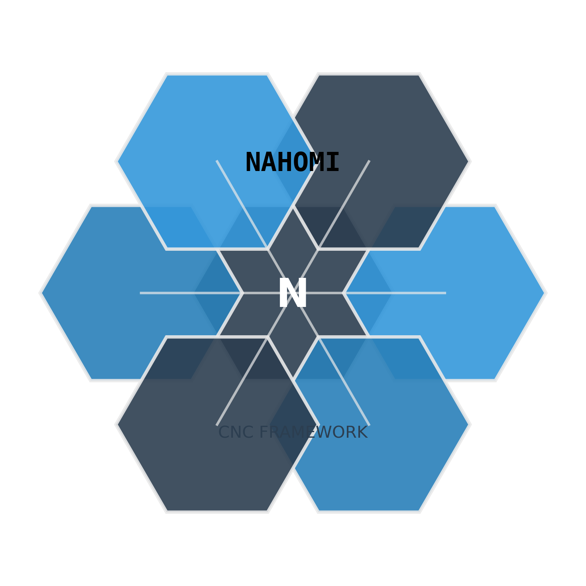

# Nahomi Commander - Framework CNC

<div align="center">
  
  
  
  **Framework de macros CNC modular | Probado en Haas VF5 | Licencia MIT**
  
  *"Donde la precisión encuentra la dulzura"*
  
  [](LICENSE.txt)
  [](README.md)
  [](CHANGELOG.md)
  
</div>

## 🚀 Comenzar en 30 segundos

```nc
O1000 (EJEMPLO_BÁSICO)
G90 G40 G49 G80
G21

(G65 P8000 W[función] T[herramienta] S[RPM] Z[profundidad] R[retracción])
G65 P8000 W1. T1 S1800 Z-12. R3. F0.15 A0. C4.

M30
